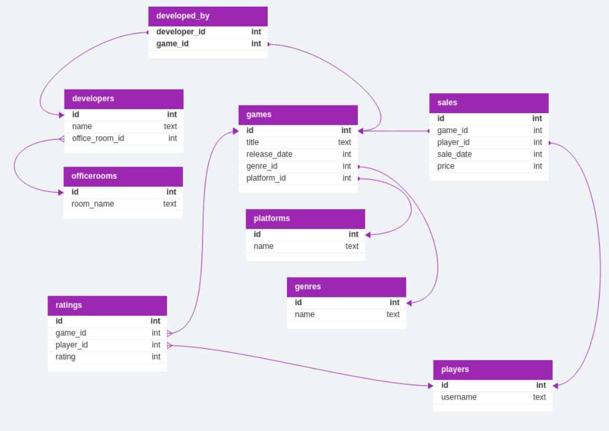

# НИЯУ МИФИ. ИИКС. Лабораторная работа №1. Соколов Александр, Б20-505. 2023.

## Обзор предметной области

Данная схема представляет собой компанию по разработке игр и игровой магазин "Gnomic". Она включает в себя следующие сущности и связи:

Сущности:

1. games: Хранит информацию о играх, включая их идентификатор, название, дату выпуска, жанр и платформу.
2. players: Представляет пользователей или игроков игр, с указанием идентификатора и имени пользователя.
3. developers: Содержит информацию о разработчиках игр, такую как идентификатор, название и офисную комнату.
4. officerooms: Представляет физические офисные помещения, связанные с разработчиками.
5. sales: Отслеживает продажи, включая идентификатор продажи, идентификатор игры, идентификатор игрока, дату продажи и цену.
6. genres: Хранит различные жанры игр с их идентификатором и названием.
7. platforms: Содержит информацию о платформах, на которых доступны игры, с указанием идентификатора и названия.
8. ratings: Отслеживает рейтинги игр, присвоенные игроками, включая идентификатор рейтинга, идентификатор игры, идентификатор игрока и значение рейтинга.
9. developed_by: Представляет отношение многие-ко-многим между играми и разработчиками.

## Спецификация таблиц

### games

| Название Поля | Тип | Описание | Первичный ключ? | Внешний ключ? |
| --- | --- | --- | --- | --- |
| id | int | Идентификатор | да | нет |
| title | text | Название Игры | нет | нет |
| release_date | int | Таймстамп релиза | нет | нет |
| genre_id | int | Идентификатор | нет | genres.id |
| platform_id | int | Идентификатор | нет | platforms.id |

### sales

| Название Поля | Тип | Описание | Первичный ключ? | Внешний ключ? |
| --- | --- | --- | --- | --- |
| id | int | Идентификатор | да | нет |
| game_id | int | Идентификатор | нет | user.id |
| player_id | int | Идентификатор | нет | players.id |
| sale_date | int | Таймстамп продажи | нет | нет |
| price | int | Стоимость продажи | нет | нет |

### players
| --- | --- | --- | --- | --- |
| id | int | Идентификатор | да | нет |
| username | text | Имя пользователя | нет | нет |

### platforms

| Название Поля | Тип | Описание | Первичный ключ? | Внешний ключ? |
| --- | --- | --- | --- | --- |
| id | int | Идентификатор | да | нет |
| name | text | Название платформы | нет | нет |

### genres

| Название Поля | Тип | Описание | Первичный ключ? | Внешний ключ? |
| --- | --- | --- | --- | --- |
| id | int | Идентификатор | да | нет |
| name | text | Название жанра | нет | нет |

### ratings

| Название Поля | Тип | Описание | Первичный ключ? | Внешний ключ? |
| --- | --- | --- | --- | --- |
| id | int | Идентификатор | да | нет |
| game_id | int | Идентификатор | нет | games.id |
| player_id | int | Идентификатор | нет | players.id |
| rating | int | Рейтинг | нет | нет |

### developed_by

| Название Поля | Тип | Описание | Первичный ключ? | Внешний ключ? |
| --- | --- | --- | --- | --- |
| developer_id | int | Идентификатор | да | developers.id |
| game_id | int | Идентификатор | да | games.id |

### developers

| Название Поля | Тип | Описание | Первичный ключ? | Внешний ключ? |
| --- | --- | --- | --- | --- |
| id | int | Идентификатор | да | нет |
| name | text | Имя разработчика | да | нет |
| office_room_id | int | Идентификатор | нет | да |

### officerooms

| Название Поля | Тип | Описание | Первичный ключ? | Внешний ключ? |
| --- | --- | --- | --- | --- |
| id | int | Идентификатор | да | нет |
| room_name | text | Название комнаты | нет | нет |

## Диаграмма сущностей

## Доказательство 3 нормальной формы

Не очень формальные требования для 3НФ:

1) Порядок строк не несет в себе информации (вроде очевидно)
2) У столбца определенный тип данных и только он (СУБД не позволит сделать иначе)
3) Есть первичный ключ (есть везде, где-то составной)
4) Повторяющиеся группы не разрешены(все PRIMARY - UNIQUE)
5) Каждый столбец зависит только от первичного ключа - да
6) Каждый столбец зависит только от первичного ключа, полного первичного ключа и только от него - да.

## Приложение

[SQL сценарий для создания таблиц](./gnomi_cart_2.sql)

## Заключение

Была смоделирована структура базы данных для игровой студии Gnomic Cart 2. Были описаны сущности, их атрибуты и связи между ними. Была построена диаграмма сущностей.
