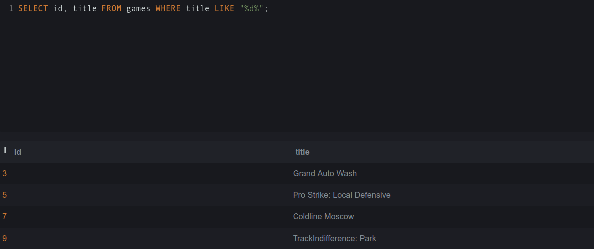
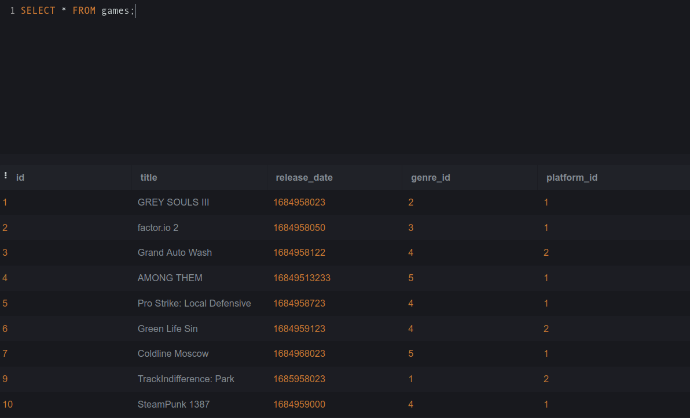
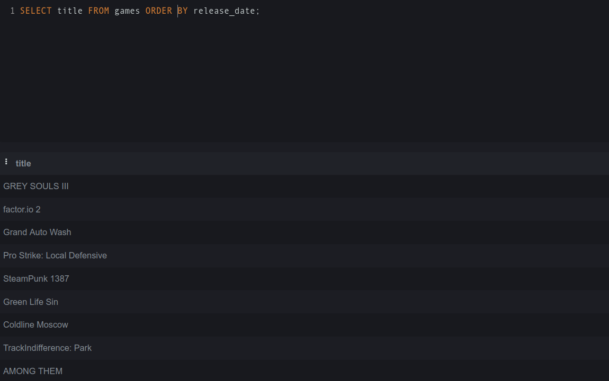
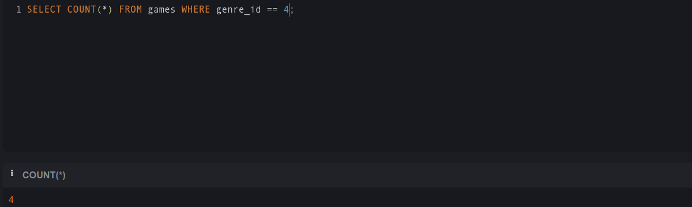
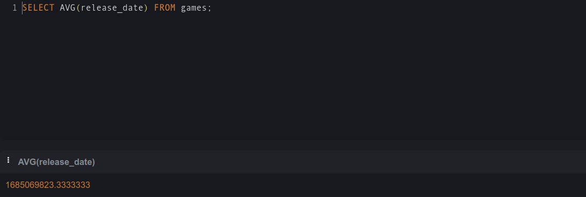
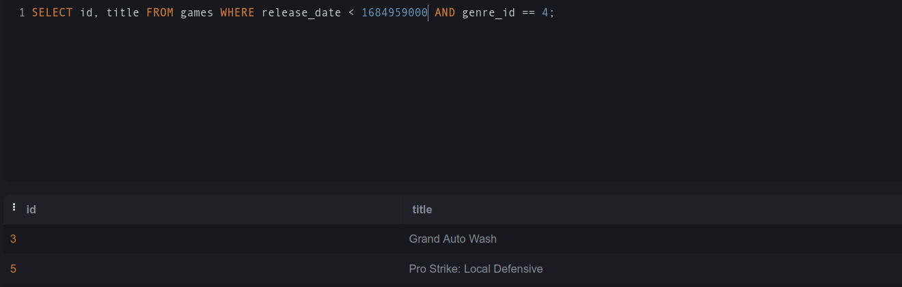
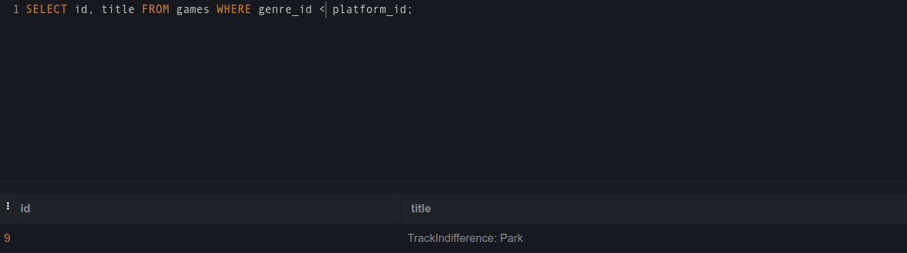

# НИЯУ МИФИ. ИИКС. Лабораторная работа №2. Соколов Александр, Б20-505. 2023.

## Генерация тестовых данных

Руками сгенерирована компания

```
INSERt INTO games VALUES (1, "GREY SOULS III", 1684958023, 2, 1);
INSERt INTO games VALUES (2, "factor.io 2", 1684958050, 3, 1);
INSERt INTO games VALUES (3, "Grand Auto Wash", 1684958122, 4, 2);
INSERt INTO games VALUES (4, "AMONG THEM", 1684951323, 5, 1);
INSERt INTO games VALUES (5, "Pro Strike: Local Defensive", 1684958723, 4, 1);
INSERt INTO games VALUES (6, "Green Life Sin", 1684959123, 4, 2);
INSERt INTO games VALUES (7, "Coldline Moscow", 1684968023, 5, 1);
INSERt INTO games VALUES (9, "TrackIndifference: Park", 1685958023, 1, 2);
INSERt INTO games VALUES (10, "SteamPunk 1387", 1684959000, 4, 1);


INSERT INTO officerooms VALUES (1, "bronze");
INSERT INTO officerooms VALUES (2, "silver");
INSERT INTO officerooms VALUES (4, "gold");
INSERT INTO officerooms VALUES (3, "garbage");

INSERT INTO developers VALUES (1, "abobus778", 1);
INSERT INTO developers VALUES (2, "abobus69", 1);
INSERT INTO developers VALUES (3, "abobus228", 1);
INSERT INTO developers VALUES (4, "abobus1337", 1);

INSERT INTO developers VALUES (5, "ponpon10", 2);
INSERT INTO developers VALUES (6, "ponpon12", 2);

INSERT INTO developers VALUES (7, "anna", 3);
INSERT INTO developers VALUES (8, "konstantin", 3);
INSERT INTO developers VALUES (9, "VITALYA", 3);
INSERT INTO developers VALUES (10, "tima", 3);

INSERT INTO developed_by VALUES (1, 1);
INSERT INTO developed_by VALUES (1, 2);

INSERT INTO developed_by VALUES (2, 1);
INSERT INTO developed_by VALUES (2, 2);

INSERT INTO developed_by VALUES (3, 2);
INSERT INTO developed_by VALUES (3, 3);

INSERT INTO developed_by VALUES (4, 3);

INSERT INTO developed_by VALUES (5, 4);
INSERT INTO developed_by VALUES (6, 4);

INSERT INTO developed_by VALUES (7, 5);
INSERT INTO developed_by VALUES (8, 5);
INSERT INTO developed_by VALUES (9, 5);

INSERT INTO developed_by VALUES (7, 6);
INSERT INTO developed_by VALUES (8, 6);
INSERT INTO developed_by VALUES (9, 6);

INSERT INTO developed_by VALUES (8, 7);
INSERT INTO developed_by VALUES (9, 7);

INSERT INTO developed_by VALUES (10, 8);

INSERT INTO developed_by VALUES (10, 9);

INSERT INTO genres VALUES (1, "rasists");
INSERT INTO genres VALUES (2, "survival");
INSERT INTO genres VALUES (3, "manufacture");
INSERT INTO genres VALUES (4, "open world");
INSERT INTO genres VALUES (5, "ubivalka");

INSERT INTO platforms VALUES (1, "pc");
INSERT INTO platforms VALUES (2, "ps");

INSERT INTO players VALUES (1, "zimich");
INSERT INTO players VALUES (2, "ne bakunin");
INSERT INTO players VALUES (3, "koxed");
INSERT INTO players VALUES (4, "anzan");
INSERT INTO players VALUES (5, "vorusha");
INSERT INTO players VALUES (6, "minishuk");
INSERT INTO players VALUES (7, "ivanos");
INSERT INTO players VALUES (8, "mirrro");
INSERT INTO players VALUES (9, "vega");
INSERT INTO players VALUES (10, "nigg");

INSERT INTO sales VALUES (1, 1, 1, 1684970415, 1000);
INSERT INTO sales VALUES (2, 2, 1, 1684964131, 2000);
INSERT INTO sales VALUES (3, 3, 2, 1684969984, 100);
INSERT INTO sales VALUES (4, 4, 3, 1684962795, 30);
INSERT INTO sales VALUES (5, 5, 4, 1684969904, 2);
INSERT INTO sales VALUES (6, 6, 5, 1684969996, 100);
INSERT INTO sales VALUES (7, 7, 7, 1684963601, 103);
INSERT INTO sales VALUES (8, 9, 6, 1684964233, 78);
INSERT INTO sales VALUES (9, 10, 8, 1684966290, 100000);
INSERT INTO sales VALUES (10, 2, 9, 1684963452, 2002);
INSERT INTO sales VALUES (11, 3, 10, 1684966085, 99);
INSERT INTO sales VALUES (12, 4, 10, 1684968850, 31);

INSERT INTO ratings VALUES (1, 5, 4, 0);
INSERt INTO ratings VALUES (2, 3, 10, 10);
INSERT INTO ratings VALUES (3, 4, 10, 5);
```

В репозитории приложена уже сгенерированная `tw2tter.db`. Внешняя зависимость генератора - библиотека `lorem`.


## Разработанные запросы

### Поиск игр содержащих букву d

Запрос:



### Вывод таблицы games

Запрос: 



### Поиск названия игр, отсортированных по их дате выпуска 

Запрос: 




### Поиск количества игр жанра 4 

Запрос: 



### Вывести самую cтарую игру

Запрос: 


### Вывести средний таймстамп выпуска игр 
Запрос: 



### Найти все игры выпущенные ранее n жанра 4

Запрос: 



### Найти все игры с жанром 

Запрос: 




### Среднее количество подписок для приватных/публичных пользователей

Запрос: `SELECT is_private, AVG(n_subscribers) as subscribers_average FROM (SELECT followee, user.is_private, COUNT(*) AS n_subscribers FROM subscription JOIN user ON followee = user.id  GROUP BY followee  ORDER BY n_subscribers DESC) GROUP BY is_private;`

```
----------  -------------------
is_private  subscribers_average
0           5.902439024390244
1           1.0
----------  -------------------
```

## Запустить запросы на своих данных

Для этого был разработан сценарий `queries.py`; запуск этого сценария выведет результаты работы приведенных выше запросов на файле `tw2tter.db`. Внешняя зависимость: `tabulate`.

```bash
python3 queries.py
```

## Приложение

[Генератор](./generator.py)  
[Модели](./models.py)  
[Запросы](./queries.py)  

## Заключение

Был разработан сценарий для генерации тестовых данных и ряд запросов для получения актуальной информации для заданной предметной области. Так как работы 2 и 3 отличаются только набором предлагаемых для использования возможностей SQL, в этой лабораторной работе были разработаны запросы, возможности которых я хорошо понимаю (простые join'ы, вложенные запросы). Это позволит сосредоточиться на изучении более сложных возможностей SQL (оконные функции, табличные выражения, сложные join'ы и разница их вариаций) в лабоработорной работе #3.

Также отмечу, что таблицы `notification` и `posttaglink` не были ни заполнены, ни использованы.
