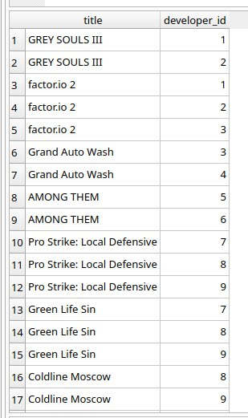

# НИЯУ МИФИ. ИИКС. Лабораторная работа №3. Соколов Александр, Б20-505. 2023.  

## Разработанные запросы

### Получить соответствие между играми и их разработчиками (id разработчика)
Запрос: `select games.title, developed_by.developer_id from games join developed_by on developed_by.game_id = games.id`



### Получить соответствие между играми и разработчиками (имя разработчика)

Запрос: `select games.title, developers.name from games join developed_by on developed_by.game_id = games.id join developers on developed_by.developer_id = developers.id`


### Сколько разработчиков в каждом офисе 

Запрос: `select COUNT(developers.id), officerooms.room_name from developers join officerooms on developers.office_room_id = officerooms.id group by officerooms.id` 


### Посчитать средний рейтинг для каждой игры

Запрос: `select AVG(ratings.rating), games.id, games.title from games join ratings on games.id = ratings.game_id group by games.id` 


### Вывести все игры на pc жанра survival

Запрос: `SELECT title, release_date FROM games 
WHERE genre_id IN (SELECT id FROM genres WHERE name = 'survival') 
AND platform_id IN (SELECT id FROM platforms WHERE name = 'pc')`


### Вывести топ 10 игроков по потраченным деньгам

Запрос: ```SELECT players.username, COUNT(sales.id) as purchases, SUM(sales.price) as total_spent 
FROM players 
JOIN sales ON players.id = sales.player_id 
GROUP BY players.id 
ORDER BY total_spent DESC 
LIMIT 10```


### Вывести топ игр по рейтингу

Запрос: ```SELECT games.title, AVG(ratings.rating) as rating 
FROM games 
LEFT JOIN ratings ON games.id = ratings.game_id 
GROUP BY games.id 
ORDER BY rating DESC```


### Продажи в зависимости от жанра

Запрос: ```SELECT genres.name, COUNT(sales.id) as total_sales, SUM(sales.price) as total_revenue 
FROM genres 
JOIN games ON genres.id = games.genre_id 
JOIN sales ON games.id = sales.game_id 
GROUP BY genres.id```


## Заключение

Были разработаны более сложные запросы к разработанной БД.
